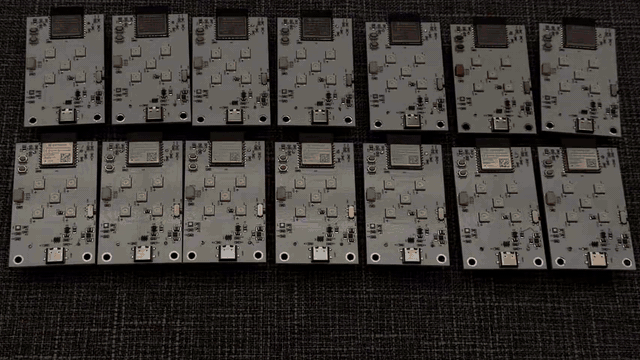
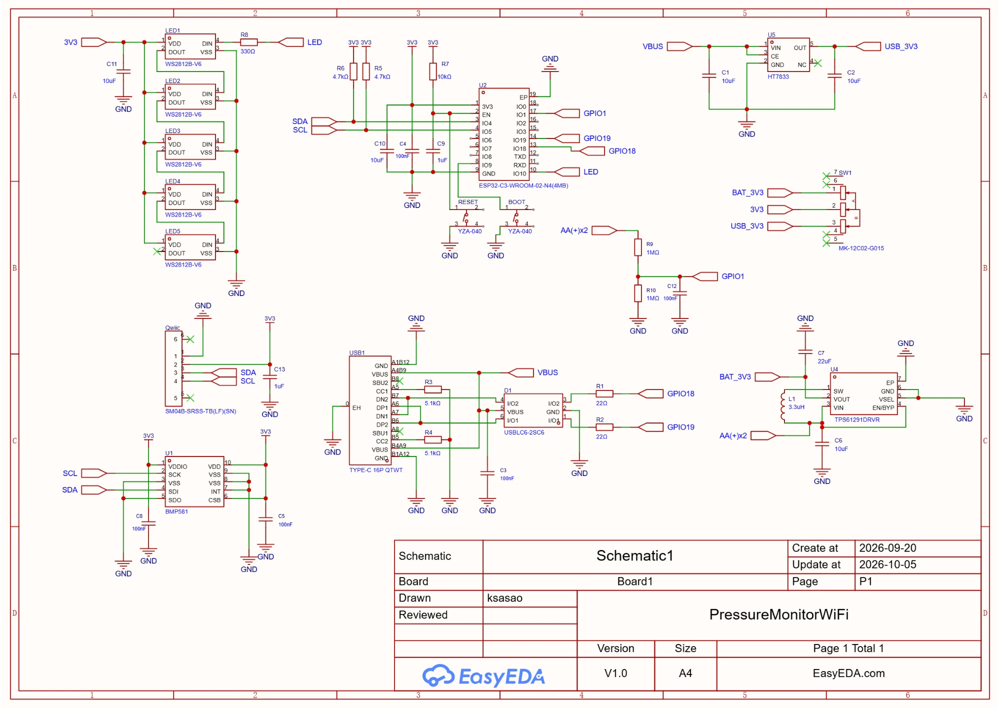

# BMP581搭載 ESP32-C3 気圧変動可視化開発ボード

Bosch製の高精度気圧センサBMP581を搭載し、気圧の微小な変化を測定して、5個のRGB LEDの光としてリアルタイムに可視化するESP32-C3搭載ボードです。
単三電池ボックスを備えており、単三電池2本で単独動作できます。また、USB-C経由でプログラムを書き換えることができ、汎用のESP32-C3開発ボードとしても利用できます。
さらにQwiicコネクタを搭載しているため、ファームウェアを書き換えることでI²Cセンサなどを追加し、さまざまな環境センシング用途へ拡張できます。

[よくある質問](faq/)にまとめています。

## 回路図

2026-10-05 版。

### 回路の構成

| 部分 | 部品 | 内容 |
|---|---|---|
| マイコン | U2（ESP32-C3-WROOM-02-N4） | RESET ボタン（EN）と BOOT ボタン（IO9） |
| 気圧センサ | U1（BMP581） | I2C、アドレス 0x46（SDO=GND）。SDA は IO4、SCL は IO5 |
| LED | LED1〜LED5（WS2812B-V6） | データは IO10 から R8 330Ω を通して LED1 へ。5 個がデイジーチェーン |
| USB | USB1（USB-C）、U5（HT7833） | VBUS を 3.3V にする。D-/D+ は IO18/IO19 |
| 電池 | U4（TPS61291）、単三 2 本 | 昇圧して 3.3V にする |
| 電源の切り替え | SW1 | 3V3 を、電池（BAT_3V3）と USB（USB_3V3）のどちらから取るかを選ぶスライドスイッチ |
| 電池電圧 | R9、R10、C12 | 電池電圧を 1/2 に分圧して IO1 へ（ADC で読める） |
| Qwiic | Qwiic コネクタ | I2C バス（3V3、SDA、SCL）に接続。他の I2C 機器をつなげる |

## ファームウェア

[firmware/esp32c3-bmp581](https://github.com/ksasao/pressure-monitor/tree/main/firmware/esp32c3-bmp581) に Arduino スケッチがあります。必要なライブラリ、ボード設定、調整できるパラメータは README を参照してください。

## 使い方

### 表示の見かた

| LED | 意味 |
|---|---|
| LED1 | 今の気圧の変化 |
| LED2〜LED5 | 1 フレームごとに前の LED1 の色が流れていく |

| 色 | 意味 |
|---|---|
| 青 | 気圧が上がった（センサを下げた） |
| オレンジ | 気圧が下がった（センサを持ち上げた） |
| 明るさ | 変化が大きいほど明るく、最大で白 |
| 消灯 | 変化がごくわずか |

気圧そのものではなく、ハイパスフィルタで取り出した「変化」を表示します。センサを動かさなければ、しばらくすると消灯します。

### ボタン

BOOT ボタンを押すたびに、次の順で表示が切り替わります。

1. 気圧の変化（起動時）
2. 気圧の絶対値を 5 段階のバーで表示
3. 消灯

### 電源

単三電池 2 本、または USB-C から給電できます。SW1 で切り替えます。

## 制約

- 電池と USB のどちらで動いているかは、回路の構成上、ソフトウェアでは判別できません。
- 電池電圧は IO1 で読むことができます。ファームウェアは、1 分に 1 回、シリアルに出力します。
- BMP581 は温度補正済みの気圧を出力します。起動直後は、センサの自己発熱で温度が上がり続けますが、ハイパスフィルタがゆっくりした変化を除くので、表示への影響は小さいです。
